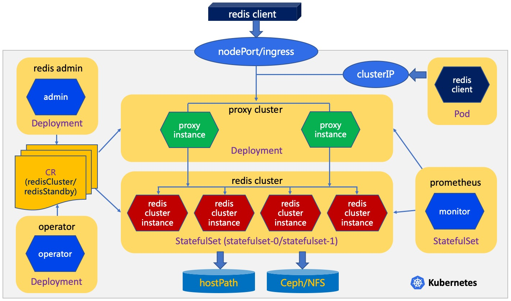

<a href="README.md">English Documents</a>  |  <a href="README-zh.md">中文文档</a>

<br>

# Background

As a leading third-party intelligent risk management and decision-making service provider in China, <a href="https://www.tongdun.net">Tongdun Technology</a> handles tens of billions of decision-making requests every day. Therefore, in Tongdun's main data storage infrastructure, Redis is widely used as a cache component. During the peak business period, the cluster actually deploys more than a thousand Redis instances, which is bound to bring great challenges to DBA operation and maintenance management and control. In 2018, we promoted the full containerization of stateless applications in the group, and created a cache cloud product that combines cloud-native technology! <br>

The first version of td-redis-operator can be traced back to 2018. The external open source version is the second version. The development time has continued from July 2018 to the present. At present, the Redis clusters of the two centers in Tongdun are all deployed in On the ultra-large kubernetes cluster.<br>

Current scale：
* Redis instance 5000+
* PB level data
* Involving 1000+ real-time online business applications.

<br>

# Introduction

## Overview

Completely based on cloud native technology to realize resource lifecycle management, fault self-healing, HA, etc.

<a href="https://github.com/tongdun/td-redis-operator/wiki/Introduction">Click here to view detailed information</a> about Introduction.


## Architecture



Description:
* Based on <a href="https://kubernetes.io/docs/concepts/extend-kubernetes/operator/">Operator</a> open source products, it is completely operated and maintained on kubernetes.
* Two types of RedisCluster and Active/Standby are supported.


<br>

# QuickStart

## QuickStart with HELM

You can use the `helm` command to install:

```
$ helm repo add td-redis-operator https://tongdun.github.io/td-redis-operator/charts/td-redis-operator
$ helm repo update
$ helm install [RELEASE_NAME] td-redis-operator/td-redis-operator      
```

For detailed documentation on installation via `helm`, see <a href="https://github.com/tongdun/td-redis-operator/wiki/Install-td-redis-operator-via-HELM"> Installation documentation via HELM </a>.

## QuickStart with YAML

In addition to installing with `helm`, you can also install it via the `kubectl` command:

```
$ kubectl apply -f https://raw.githubusercontent.com/tongdun/td-redis-operator/main/deploy/deploy.yaml
$ kubectl apply -f https://raw.githubusercontent.com/tongdun/td-redis-operator/main/cr/redis_cluster.yaml
$ kubectl apply -f https://raw.githubusercontent.com/tongdun/td-redis-operator/main/cr/redis_standby.yaml

```

For more YAML files, see <a href="https://github.com/tongdun/td-redis-operator/wiki/Install-td-redis-operator-via-YAML"> Installation documentation via YAML </a>.

<br>

# AdminGuide

<a href="https://github.com/tongdun/td-redis-operator/wiki/Admin-Guide">Click here to view detailed information</a> about AdminGuide.

<br>

# Roadmap for future plans

We will support the following features in the future:

* Support customization of service exposure ServiceType parameter.
* Cache node shrink scene logic optimization.
* Supports customization of storage parameters.
* Support all kinds of back-end storage (hostPath/NFS/Ceph rbd/cephfs/public cloud storage...).
* Open source the supporting redis web management platform.
* The web platform also supports monitoring curves.
* ...


<br>

# Community group

Welcome to our open source community `WeChat` group for detailed communication. Please scan the following QR code to join us:
    
   

(Fill in the "td-redis-operator" character when applying.)

<br>

# Wiki

<a href="https://github.com/tongdun/td-redis-operator/wiki">https://github.com/tongdun/td-redis-operator/wiki</a>

<br>
<br>

